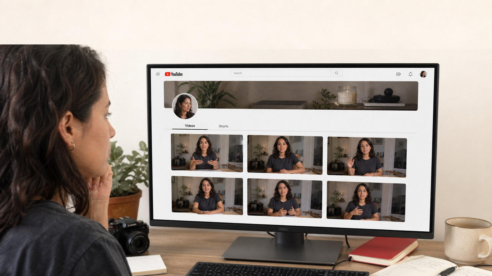
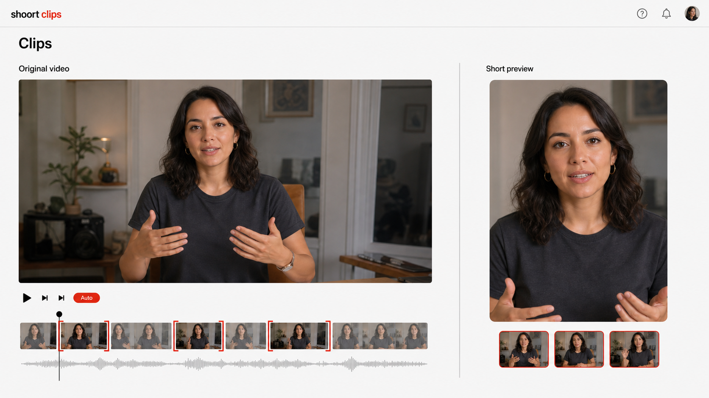
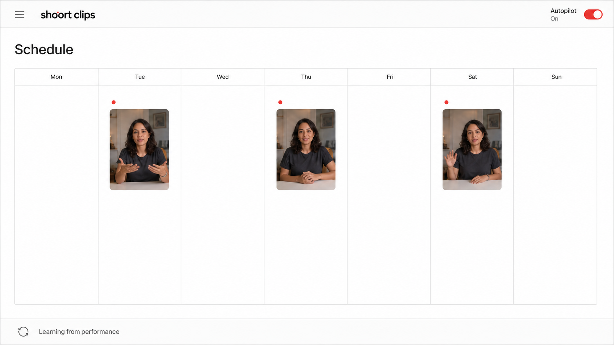
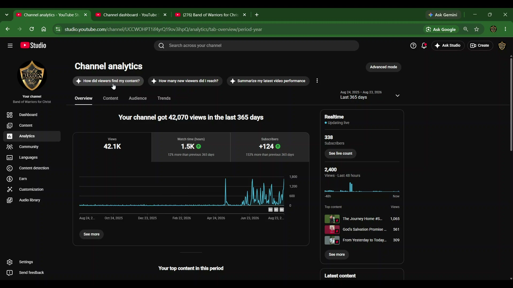

# Shoort Clips — real-world creator film, v2

**Use this kit instead of the glossy AI-device version.** Five 10-second scenes, total 50 seconds.

## The story

"Struggling to grow your YouTube? No time for Shorts?" → the agent cuts usable Shorts → it plans and schedules the batch → a separate real client example → the creator gets back to creating.

The visual direction is grounded in YouTube's own Create product materials: recognizable editing workflows and concise benefits. Our interpretation adds natural creator B-roll and keeps Shoort Clips' cream, black and red identity. See RESEARCH-NOTES.md for the official references.

## What is supplied

- Four newly generated, realistic-style reference PNGs: 01, 02, 03 and 05.
- One authentic client screenshot JPG: 04, copied from frame-69.jpg extracted from the original recording. No glowing frame and no graph tooltip.
- Five standalone PROMPT-01.txt through PROMPT-05.txt files, each complete and ready to paste.
- This guide, the research notes and original image-generation prompt set.

These are reference images, not completed videos. The creator and the simplified application screens are generated illustrations, not actual client photos or verified screenshots of a working Shoort Clips UI. They demonstrate the intended workflow. Label the UI scenes "Illustrative workflow" in small editorial type.

The female creator is a fictional demonstration character. She is NOT the client whose analytics appear in scene 4. Keep that scene clearly identified as a separate client example.

## Settings and voice

Use a single Flow project. Where available, choose **Video → Omni Flash → Ingredients**, **16:9**, **10 seconds**. Upload the relevant numbered reference and attach the same saved narrator voice every time. Keep **Return silent videos OFF**.

Choose a male voice from the actual presets visible in your account; preview for natural warmth and clarity. No need to search for "Andrew." If custom voices are available, save your chosen base voice as **ShoortNarrator**. Set its performance direction to:

> Warm, clear, conversational male narrator, medium-low register, neutral international English, friendly authority. A knowledgeable creator explaining a useful tool. Natural breaths, a slight smile, clear consonants and restrained enthusiasm. Around 150–165 words per minute. No movie-trailer growl, dramatic sales pauses, or overexcited influencer delivery. Pronounce Shoort Clips as Short Clips.

Voice references require Ingredients, not Frames. The supplied image guides the composition; Ingredients does not guarantee pixel-identical frame one. [Google: video, visual and voice references](https://support.google.com/flow/answer/16353334?hl=en)

Ten-second Omni Flash outputs and the silent setting are documented by Google; options can differ by model/account. [Google: settings and formats](https://support.google.com/flow/answer/16935308?hl=en)

## Sequence and narration

| Time | Image | Beat |
|---|---|---|
| 0–10s | 01-creator-problem.png | The creator's problem |
| 10–20s | 02-clipping-workflow.png | Show the actual editing task |
| 20–30s | 03-autopilot-calendar.png | Autopilot handles the schedule |
| 30–40s | 04-real-client-analytics.jpg | A separate, real client example |
| 40–50s | 05-creator-back-to-recording.png | Give the creator time back |

### 01. The creator's problem — 0–10s



**Narration:** “Struggling to grow your YouTube channel? You’re already making videos. Finding time to turn them into Shorts is another job.”

**Editorial text:**

- 0–4s: Struggling to grow your YouTube?
- 4–10s: No time for Shorts?

Use [PROMPT-01.txt](PROMPT-01.txt).

### 02. Show the actual editing task — 10–20s



**Narration:** “Meet Shoort Clips. Our agentic AI finds the strongest moments in your long videos, cuts the Shorts, and gets them ready.”

**Editorial text:**

- One long video. Your next Shorts.
- Small disclosure: Illustrative workflow

Use [PROMPT-02.txt](PROMPT-02.txt).

### 03. Autopilot handles the schedule — 20–30s



**Narration:** “Switch on autopilot. Your agent plans the cadence, schedules approved clips, and keeps learning from your audience—so you don’t have to.”

**Editorial text:**

- Your Shorts. Planned and scheduled.
- Small supporting line: You approve. The agent runs the plan.
- Small disclosure: Illustrative workflow

Use [PROMPT-03.txt](PROMPT-03.txt).

### 04. A separate, real client example — 30–40s



**Narration:** “One client added repurposed Shorts and saw momentum. Their annual channel totals: over forty-two thousand views and one hundred twenty-four subscribers gained.”

**Editorial text:**

- Separate client example • Last 365 days
- Channel-wide totals. Results vary.

Use [PROMPT-04.txt](PROMPT-04.txt).

### 05. Give the creator time back — 40–50s


**Narration:** “Less time editing. More time creating. Let your agent handle the Shorts and the schedule. Get started at shoortclips dot com.”

**Editorial text:**

- Less editing. More creating.
- shoortclips.com
- Get started →

Use [PROMPT-05.txt](PROMPT-05.txt).


## How to generate and assemble

1. Generate scene 1 first and review the feel before generating the rest. For each shot, attach its numbered image and the saved narrator, then paste only that shot's complete prompt. Reuse the same model, aspect ratio and voice.
2. Use normal movement: cursor, playhead, preview crop, selection border, calendar status, natural B-roll gesture. No free-floating graphics or magical UI transformations.
3. Cut straight from 1 → 2 → 3 → 4 → 5 at 10-second boundaries. A direct cut from the monitor shot to the full-screen editor feels like entering the workflow. The editor-to-calendar cut advances the task. No seamless morphing is needed.
4. Add the short headlines after generation to prevent text drift. Use Manrope bold and DM Sans supporting copy. Put the opening question on the clean upper wall and the final CTA on the empty left wall. Keep lines brief.
5. Use scene 2's simple wordmark style consistently if adding an editorial logo: black "shoort", red "clips". Generated header details differ slightly between scenes; standardize the wordmark in the final edit if visible at presentation size. Do not alter documentary YouTube branding in scene 4.
6. Add "Illustrative workflow" discreetly to scenes 2–3. Add "You approve. The agent runs the plan." to scene 3 so autopilot does not contradict the website's approval-first promise.
7. Show the proof at **30–40 seconds**. Use the original screenshot full-screen, or crop it in the editor to remove the browser chrome while retaining the headline, all three key metric cards, full growth curve, and Last 365 days/date selector. Never redraw, stretch, or alter the graph or numbers.
8. Because generative video may change UI text, compare the generated proof at the beginning, middle and end. If anything changes, overlay the supplied original JPG for all ten seconds while keeping Flow's narration. A still evidence beat is intentional; documentary accuracy takes priority over animating this one shot.
9. Use a small explicit evidence label: "Separate client example • Last 365 days" and "Channel-wide totals. Results vary." Put labels in a safe outer strip or unused area, never over relevant numbers or dates.
10. Hold the closing CTA for at least three seconds: **Less editing. More creating.** / **shoortclips.com** / **Get started →**. The URL has two o's even though spoken as "short clips dot com."
11. Optional: add one low-volume continuous music track after assembly. Avoid five separate generated music tracks. Keep the voice dominant and do not cover a rushed or clipped line with music; regenerate that scene.
12. Export a 50-second 16:9 MP4. Keep the generated aspect ratio; do not stretch the images. Use 1080p when supported by the source video. Insert the final film in the existing product-tour section of shoortclips.com (#proof).

The website already introduces an autopilot product tour, so this revision changes the creative assets and script only; no new website or deployment changes were made in this revision.

## Evidence wording — keep this distinction

The screenshot reports August 24, 2025–August 23, 2026, **Last 365 days**:

- **42,070 views** (42.1K in the metric card).
- **1.5K watch hours**.
- **+124 subscribers**.
- A visibly more active later portion of the annual graph.

It is not year-to-date, not a clean before/after experiment, and not a three-month total. Different content formats contributed to the channel-wide results. The statement that repurposed Shorts were added before the client saw momentum comes from your account of the engagement. Do not claim the screenshot independently proves the start date or that the agent alone caused every gain. Do not add a "we started here" marker without verifying the date.

The model in scenes 1, 2, 3 and 5 has no association with this client. Do not give her a testimonial or animate her celebrating the client's numbers. Confirm clearance for public use of the client screenshot before publishing the film.

## Complete Flow prompts

### Prompt 01

Attach **01-creator-problem.png** and the same narrator voice.

```text
Create one 10-second, 16:9 shot for a realistic Shoort Clips creator-product advertisement. Use the attached numbered image as the primary composition and identity reference. Begin as close to its composition as possible.

ART DIRECTION
Recognizable creator life and useful software interactions. Real photographic footage where people appear; crisp flat software capture where interfaces appear. Daylight, natural skin and fabric texture, neutral whites and cream, near-black type, restrained functional red. Clean and confident, like a practical creator-tool demonstration. No glossy AI devices, robots, floating cubes, holograms, neon trails, floating UI, 3D interface extrusion or dramatic lens flares. Preserve the supplied face, clothing, room, layout and existing labels. The editor and calendar are simplified illustrative Shoort Clips screens; never present them as native YouTube controls or imply YouTube endorsement.

AUDIO
Use the same attached saved male narrator voice for all five clips. Warm, clear, conversational medium-low register, neutral international English, approximately 150–165 words per minute. Sound like a knowledgeable creator explaining a useful tool, not a movie trailer or aggressive sales pitch. Start near 0.2 seconds and finish by 9.5 seconds. Speak the exact narration below once and only once. Pronounce Shoort Clips as "Short Clips" and shoortclips dot com as "short clips dot com." No extra words. The woman is silent B-roll, never the narrator. No music, sound effects or ambient sound in this generation; a single continuous music bed can be added later.

TEXT AND CAMERA
Do not invent subtitles, titles, URLs, watermarks, statistics or dense labels. Keep existing UI text stable. Headline overlays will be added editorially for exact spelling. One controlled shot; only the action below. No internal cuts, no scene morphing, no fade to black. Leave the final half-second visually settled for the next shot.

SCENE 01 — THE CREATOR'S PROBLEM
PRIMARY REFERENCE: 01-creator-problem.png

ACTION
Start on the supplied real-world creator-at-desk composition. Keep the same woman, charcoal shirt, home studio and readable YouTube-style channel page. 0–3 seconds: she studies her library of long-form videos, with a subtle thoughtful breath and small natural eye movement. No exaggerated frustration. 3–6 seconds: one ordinary mouse cursor moves from the existing Videos tab toward the existing Shorts tab; the tab receives a restrained underline, while the existing interface remains structurally stable. Do not invent an empty-channel statistic or a falling graph. 6–9 seconds: her mouse hand pauses; a subtle camera push toward the monitor makes the task feel tangible. Keep the clean upper wall available for the two short editorial headlines. 9–10 seconds: settle the camera so the editor can cut directly to the full-screen clipping interface. Do not make the monitor transform, bend or become a hologram. The woman is silent illustrative B-roll, not the narrator or the client.

EXACT NARRATION
"Struggling to grow your YouTube channel? You’re already making videos. Finding time to turn them into Shorts is another job."
```

### Prompt 02

Attach **02-clipping-workflow.png** and the same narrator voice.

```text
Create one 10-second, 16:9 shot for a realistic Shoort Clips creator-product advertisement. Use the attached numbered image as the primary composition and identity reference. Begin as close to its composition as possible.

ART DIRECTION
Recognizable creator life and useful software interactions. Real photographic footage where people appear; crisp flat software capture where interfaces appear. Daylight, natural skin and fabric texture, neutral whites and cream, near-black type, restrained functional red. Clean and confident, like a practical creator-tool demonstration. No glossy AI devices, robots, floating cubes, holograms, neon trails, floating UI, 3D interface extrusion or dramatic lens flares. Preserve the supplied face, clothing, room, layout and existing labels. The editor and calendar are simplified illustrative Shoort Clips screens; never present them as native YouTube controls or imply YouTube endorsement.

AUDIO
Use the same attached saved male narrator voice for all five clips. Warm, clear, conversational medium-low register, neutral international English, approximately 150–165 words per minute. Sound like a knowledgeable creator explaining a useful tool, not a movie trailer or aggressive sales pitch. Start near 0.2 seconds and finish by 9.5 seconds. Speak the exact narration below once and only once. Pronounce Shoort Clips as "Short Clips" and shoortclips dot com as "short clips dot com." No extra words. The woman is silent B-roll, never the narrator. No music, sound effects or ambient sound in this generation; a single continuous music bed can be added later.

TEXT AND CAMERA
Do not invent subtitles, titles, URLs, watermarks, statistics or dense labels. Keep existing UI text stable. Headline overlays will be added editorially for exact spelling. One controlled shot; only the action below. No internal cuts, no scene morphing, no fade to black. Leave the final half-second visually settled for the next shot.

SCENE 02 — SHOW THE ACTUAL EDITING TASK
PRIMARY REFERENCE: 02-clipping-workflow.png

ACTION
Start on the exact supplied flat Shoort Clips editing layout, full-screen. This is a separate Shoort Clips workspace, NOT a feature inside YouTube. 0–2 seconds: the existing Auto indicator receives one brief color emphasis, with no glowing effect. 2–5 seconds: move the playhead left to right over the first selected timeline segment. The landscape preview and vertical preview show the same woman's footage with matching subtle head and hand motion. 5–8 seconds: emphasize each of the three existing selection brackets in sequence, as if the agent identifies three usable moments; move a simple selection border across the existing three output thumbnails. 8–10 seconds: settle on the vertical Short preview. Keep the source video, portrait result and timeline large and readable. All activity remains inside the existing application panels; no panels fly out into space. No added text or invented controls. No fake metric counter. The footage is silent B-roll beneath the separate narrator, never lip-sync it to the male narration. End on a stable screen for a direct cut to the calendar.

EXACT NARRATION
"Meet Shoort Clips. Our agentic AI finds the strongest moments in your long videos, cuts the Shorts, and gets them ready."
```

### Prompt 03

Attach **03-autopilot-calendar.png** and the same narrator voice.

```text
Create one 10-second, 16:9 shot for a realistic Shoort Clips creator-product advertisement. Use the attached numbered image as the primary composition and identity reference. Begin as close to its composition as possible.

ART DIRECTION
Recognizable creator life and useful software interactions. Real photographic footage where people appear; crisp flat software capture where interfaces appear. Daylight, natural skin and fabric texture, neutral whites and cream, near-black type, restrained functional red. Clean and confident, like a practical creator-tool demonstration. No glossy AI devices, robots, floating cubes, holograms, neon trails, floating UI, 3D interface extrusion or dramatic lens flares. Preserve the supplied face, clothing, room, layout and existing labels. The editor and calendar are simplified illustrative Shoort Clips screens; never present them as native YouTube controls or imply YouTube endorsement.

AUDIO
Use the same attached saved male narrator voice for all five clips. Warm, clear, conversational medium-low register, neutral international English, approximately 150–165 words per minute. Sound like a knowledgeable creator explaining a useful tool, not a movie trailer or aggressive sales pitch. Start near 0.2 seconds and finish by 9.5 seconds. Speak the exact narration below once and only once. Pronounce Shoort Clips as "Short Clips" and shoortclips dot com as "short clips dot com." No extra words. The woman is silent B-roll, never the narrator. No music, sound effects or ambient sound in this generation; a single continuous music bed can be added later.

TEXT AND CAMERA
Do not invent subtitles, titles, URLs, watermarks, statistics or dense labels. Keep existing UI text stable. Headline overlays will be added editorially for exact spelling. One controlled shot; only the action below. No internal cuts, no scene morphing, no fade to black. Leave the final half-second visually settled for the next shot.

SCENE 03 — AUTOPILOT HANDLES THE SCHEDULE
PRIMARY REFERENCE: 03-autopilot-calendar.png

ACTION
Begin on the supplied flat Shoort Clips calendar. Preserve the seven columns in the correct Monday-to-Sunday order and the three existing creator thumbnails. The Autopilot toggle is already On in the reference; do not toggle it off or invent a click to enable it. 0–2 seconds: place a subtle ordinary focus outline around that toggle, drawing attention to the enabled mode. 2–6 seconds: acknowledge the three occupied calendar cells in sequence using their existing small red status dots, one brief flat pulse per cell, as the planned batch is queued. Keep the thumbnails inside their existing Tuesday, Thursday and Saturday cells; do not add extra publishing days or promise a universal schedule. 6–8 seconds: rotate the small circular-arrow icon at the lower left once, next to the existing Learning from performance label. 8–10 seconds: hold the completed calendar. Camera locked, all text and grid geometry stable. This conveys an approval-based agent workflow; do not add a Published message or suggest unapproved uploads. End with a clean, stable screen.

EXACT NARRATION
"Switch on autopilot. Your agent plans the cadence, schedules approved clips, and keeps learning from your audience—so you don’t have to."
```

### Prompt 04

Attach **04-real-client-analytics.jpg** and the same narrator voice.

```text
Create one 10-second, 16:9 shot for a realistic Shoort Clips creator-product advertisement. Use the attached numbered image as the primary composition and identity reference. Begin as close to its composition as possible.

ART DIRECTION
Recognizable creator life and useful software interactions. Real photographic footage where people appear; crisp flat software capture where interfaces appear. Daylight, natural skin and fabric texture, neutral whites and cream, near-black type, restrained functional red. Clean and confident, like a practical creator-tool demonstration. No glossy AI devices, robots, floating cubes, holograms, neon trails, floating UI, 3D interface extrusion or dramatic lens flares. Preserve the supplied face, clothing, room, layout and existing labels. The editor and calendar are simplified illustrative Shoort Clips screens; never present them as native YouTube controls or imply YouTube endorsement.

AUDIO
Use the same attached saved male narrator voice for all five clips. Warm, clear, conversational medium-low register, neutral international English, approximately 150–165 words per minute. Sound like a knowledgeable creator explaining a useful tool, not a movie trailer or aggressive sales pitch. Start near 0.2 seconds and finish by 9.5 seconds. Speak the exact narration below once and only once. Pronounce Shoort Clips as "Short Clips" and shoortclips dot com as "short clips dot com." No extra words. The woman is silent B-roll, never the narrator. No music, sound effects or ambient sound in this generation; a single continuous music bed can be added later.

TEXT AND CAMERA
Do not invent subtitles, titles, URLs, watermarks, statistics or dense labels. Keep existing UI text stable. Headline overlays will be added editorially for exact spelling. One controlled shot; only the action below. No internal cuts, no scene morphing, no fade to black. Leave the final half-second visually settled for the next shot.

SCENE 04 — A SEPARATE, REAL CLIENT EXAMPLE
PRIMARY REFERENCE: 04-real-client-analytics.jpg

ACTION
This reference is an authentic screenshot extracted from the user's client recording, not a UI illustration. It belongs to a DIFFERENT channel from the fictional woman in the surrounding shots. Use the supplied screenshot as one fixed documentary image. Keep its original YouTube Studio interface, all numbers, date range, graph, sidebar, channel identity and cursor exactly unchanged. Present it full-frame with a locked camera for the entire ten seconds. No graph drawing, no growing subscriber counter, no scrolling, no invented cursor click, no new tooltip, no glow, no rebuilt dashboard and no AI restyling. Preserve the full annual growth curve, the Last 365 days label, Aug 24, 2025–Aug 23, 2026, the headline 42,070 views, the 42.1K view card, 1.5K watch hours and +124 subscribers. Do not relabel this as year-to-date or three-month results. Do not add a date marking when the engagement started. The editorial transition into and out of this evidence shot will be a plain hard cut. Speak the supplied narrator line while the genuine screenshot stays completely still. Do not carry the fictional creator's face or workspace into this shot.

EXACT NARRATION
"One client added repurposed Shorts and saw momentum. Their annual channel totals: over forty-two thousand views and one hundred twenty-four subscribers gained."
```

### Prompt 05

Attach **05-creator-back-to-recording.png** and the same narrator voice.

```text
Create one 10-second, 16:9 shot for a realistic Shoort Clips creator-product advertisement. Use the attached numbered image as the primary composition and identity reference. Begin as close to its composition as possible.

ART DIRECTION
Recognizable creator life and useful software interactions. Real photographic footage where people appear; crisp flat software capture where interfaces appear. Daylight, natural skin and fabric texture, neutral whites and cream, near-black type, restrained functional red. Clean and confident, like a practical creator-tool demonstration. No glossy AI devices, robots, floating cubes, holograms, neon trails, floating UI, 3D interface extrusion or dramatic lens flares. Preserve the supplied face, clothing, room, layout and existing labels. The editor and calendar are simplified illustrative Shoort Clips screens; never present them as native YouTube controls or imply YouTube endorsement.

AUDIO
Use the same attached saved male narrator voice for all five clips. Warm, clear, conversational medium-low register, neutral international English, approximately 150–165 words per minute. Sound like a knowledgeable creator explaining a useful tool, not a movie trailer or aggressive sales pitch. Start near 0.2 seconds and finish by 9.5 seconds. Speak the exact narration below once and only once. Pronounce Shoort Clips as "Short Clips" and shoortclips dot com as "short clips dot com." No extra words. The woman is silent B-roll, never the narrator. No music, sound effects or ambient sound in this generation; a single continuous music bed can be added later.

TEXT AND CAMERA
Do not invent subtitles, titles, URLs, watermarks, statistics or dense labels. Keep existing UI text stable. Headline overlays will be added editorially for exact spelling. One controlled shot; only the action below. No internal cuts, no scene morphing, no fade to black. Leave the final half-second visually settled for the next shot.

SCENE 05 — GIVE THE CREATOR TIME BACK
PRIMARY REFERENCE: 05-creator-back-to-recording.png

ACTION
Return to the SAME fictional creator and home studio from scene 1, using this supplied closing composition. She is now recording her next educational video to the real camera on the tripod, not reacting to the previous client's analytics. 0–3 seconds: one small natural explanatory hand gesture and a relaxed expression; she looks into her recording camera. 3–6 seconds: a gentle breathing movement and almost imperceptible camera drift create believable live-action B-roll. The camera and tripod remain physically stable. 6–10 seconds: settle into a calm composition with only subtle natural movement. Keep the left cream wall clear so the editor can display the CTA for at least the final three seconds. The laptop stays on the desk, no floating interface overlays. No newly generated URL, slogan or logo; these will be typeset in the editor. No testimonial, no mouthed sales line, no lip-sync to the narrator. Do not end on black.

EXACT NARRATION
"Less time editing. More time creating. Let your agent handle the Shorts and the schedule. Get started at shoortclips dot com."
```


## Final review

- The first three seconds communicate the viewer's problem.
- The editing scene clearly shows landscape source → portrait output, not just a button press.
- Autopilot is visibly part of Shoort Clips, not a native YouTube feature.
- UI labels, fingers, facial identity, playback and cropping stay stable.
- All five narration lines fit comfortably and use the same voice.
- The real evidence is unchanged and correctly qualified.
- The last three seconds give a readable URL and CTA.
- No implied YouTube endorsement, fabricated testimonial or guaranteed-growth claim.

The image-generation skill's natural-photography, clear-layout and identity-preservation guidance was used to create this revised reference set. Original visual prompts are in IMAGE-GENERATION-PROMPTS.md. Earlier assets remain intact for comparison.

