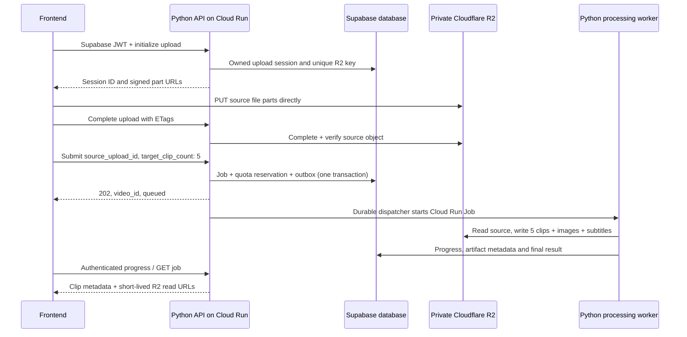

# Shoort Clips: Python API implementation request

Contract version: **1.0.0**, prepared 2026-08-31. This package specifies work to build; it is not an implemented/deployed backend. No live API URL, R2 bucket, credentials, database changes, or publishing actions were created here. Keep the frontend in preview mode until the integration checklist passes.

## Give this package to the backend builder

> Build the Shoort Clips backend in Python on Google Cloud, using this package as the acceptance contract. Implement real durable processing actions behind the API, not response-only stubs. Use Cloudflare R2 for private source and generated media, Supabase for authentication and durable metadata, and Creem for subscription billing. Preserve the OpenAPI request/response field names. Inspect and adapt any existing Python video-generation code before replacing it. That code is not present in this frontend repository.
>
> Implement Phase A first so a user can upload a source, request five clips, track progress, and review/download five real outputs. Then implement Phase B for YouTube analytics, approvals, scheduling and publishing, and billing/onboarding as described. Phase A still requires secure account access; it may use explicitly admin-granted test accounts while provider integrations are disabled. Do not enable production paid access until billing is verified. Do not claim unsupported features are connected. Deliver source, dependency lockfiles, infrastructure/deployment instructions, migrations, automated tests, test evidence, and a completed deployment report. Return configuration names and public URLs, never private credentials.

Read in this order:

1. [openapi.json](openapi.json): routes, authentication, payloads, response schemas, status codes, and WebSocket extension.
2. [python-functions.md](python-functions.md): what each service/worker function must actually do.
3. [cloud-setup.md](cloud-setup.md): infrastructure, database ownership, secrets, provider setup, and release gates.
4. [frontend-integration.md](frontend-integration.md): existing frontend calls versus changes still needed when URLs return.
5. [acceptance-tests.md](acceptance-tests.md): evidence required before a feature is called ready.
6. [deployment-report.template.json](deployment-report.template.json): fill out and return to the frontend builder.

The generated [endpoint-catalog.md](endpoint-catalog.md) is the quick route list. OpenAPI is authoritative for wire formats; Python/cloud documents define behavior. Report conflicts before deployment. Earlier root-level API, R2, billing and SQL files are historical context; this version's security requirements supersede conflicting guidance in them.

## Product workflow



One product job represents **one submitted source**. `target_clip_count` is the number of distinct output clips, not the number of Cloud Run executions, HTTP calls, copies, or queue messages. `video_id` is the app's job ID, not a YouTube video ID. Store source/published YouTube IDs separately.

## What “generate five videos” means

The current app sends this JSON after an R2 source upload:

```json
{
  "source_upload_id": "upl_example",
  "brand_id": "brand_example",
  "target_clip_count": 5,
  "subtitle_preset": "clean",
  "custom_instructions": "Prioritize useful lessons and customer stories."
}
```

The API validates account entitlement and ownership, snapshots the brand strategy and selected editing settings, reserves quota, persists a job plus dispatch record, and returns a queue acknowledgment promptly. It does not block the browser until rendering finishes.

The worker validates actual source media, extracts audio, generates a timestamped transcript, selects distinct clips, validates their boundaries, applies the brand's edit plan, crops to 9:16, creates captions, renders browser-playable MP4s, creates thumbnails and WebVTT files, verifies those outputs, uploads to R2, and commits their metadata. The server then returns exactly five usable clip records on a successful five-clip job.

If fewer than five valid moments exist or a render fails, return the real available outputs with `status: partial`, `requested_clip_count: 5`, `generated_clip_count`, and actionable warning codes. If no usable clips exist, return `failed`. Never pad with duplicates, fake media URLs, or silently call an incomplete batch fully successful. The client gets terminal progress and can fetch the partial result.

The clip-count range is 1–15 with default 5. Upload limit is 2 GiB. Other quotas (monthly source minutes, concurrent jobs, source duration, retention, model budget) are deployment configuration and must be stated in the report; do not infer unlimited usage from the monthly price.

## Implementation phases

| Phase | Deliverables | Completion evidence |
| --- | --- | --- |
| A: generate and review | JWT verification, secure entitlements, workspace/brand bootstrap, R2 multipart signing/completion, durable job submission, worker pipeline, job/clip reads, authenticated progress plus polling, retry/cancel, signed media/downloads | Five real clips from a test source; restart/retry, isolation, CORS, and expiry checks |
| B1: onboarding and billing | Pilot applications, trusted trial/invite grants, Creem checkout/portal/webhooks, entitlement reconciliation | Payment events verified in provider test mode; replay/out-of-order events cannot create or extend incorrect access |
| B2: connected channel intelligence | YouTube OAuth, channel status/disconnect, audit and analytics operations, saved evidence-backed directives | Real authorized channel data, no fabricated metrics, expired/revoked-token behavior |
| B3: approval and publishing | Caption metadata save, clip/batch approval, schedule preferences and entries, dispatcher, resumable YouTube upload, publication reconciliation | An explicitly approved test clip published only to an authorized test channel, no duplicate upload after retry |

All phases are specified. Unsupported provider features return a structured `503 FEATURE_NOT_CONFIGURED` and `capabilities` reports them disabled. Phase A does not require a working YouTube importer: owner-uploaded source files are the initial supported ingestion path.

## Contract conventions

- One public HTTPS API origin; paths are under `/api/v1`. Supply a separate `wss` base only if needed. Local examples use reserved `.invalid` domains and are not deployed URLs.
- Browser JSON endpoints verify `Authorization: Bearer <Supabase access token>`; public exceptions are health, pilot application intake, OAuth callback, and Creem webhook. Those exceptions have their own validation controls. Internal endpoints use Google service identity on a separate private service.
- Derive `user_id` from verified identity. Never trust a body/query `user_id`, raw object key, user-editable role, or provider customer ID as authority. Return 404 for non-owned resource IDs rather than disclosing their existence.
- Dates are UTC RFC 3339; schedule settings also carry an IANA timezone. Store integer byte counts and numeric seconds. Empty collections are arrays, not strings or fabricated rows. Unknown analytics metrics are null with a data-status explanation.
- Write schemas reject unexpected privileged fields. IDs are opaque strings. Versioned clip/schedule edits use `expected_version`; stale writes return 409.
- Use stable errors: `{ "detail": "Readable message", "code": "UPLOAD_INCOMPLETE", "request_id": "req_...", "retryable": false }`. Return 401 for invalid/expired sessions, 403 for inactive access, 404 for non-owned/missing resources, 409 for conflicts, 422 for invalid input/unsupported source, 429 for quota/rate limits, and 503 for unavailable features/providers. Attach `Retry-After` when retry timing is known.
- Add `Cache-Control: no-store` to authenticated responses containing signed URLs, OAuth links, or account data. Never log JWTs, signed URLs, OAuth codes/refresh tokens, transcripts, or request bodies containing personal data by default.
- Stateful/expensive POSTs accept `Idempotency-Key` (UUID generated once per user action); identical key + payload returns the stored result, changed payload returns 409. Keep mappings through the operation lifetime and at least 24 hours after terminal state. The frontend does not send this header yet: before launch add it; meanwhile enforce source-upload claims and same-owner active-job deduplication. Never silently invent an “exactly once” guarantee for external publishing.

Entitlement checks must not lock users out of account recovery: `/auth/me`, `/capabilities`, workspace bootstrap, billing checkout/status/portal, provider disconnect and owned cancellation/cleanup remain usable with a valid account even if paid/trial access is inactive. New upload/processing, media signing, audit/analytics work, render, approval, scheduling and publication require active entitlement. Ownership and rate limits still apply to recovery routes. Public callbacks/webhooks use their own signature/state validation and do not require a browser subscription check. Report any product-policy change to this matrix before frontend activation.

## Durable progress protocol

`GET /api/v1/jobs/{video_id}` is the source of truth after reload or connection loss. It includes status, `stage`, `progress`, message, counts, warnings, and fresh clip asset URLs. Poll every 3–5 seconds while running, with backoff on network failures; no polling after terminal state.

For WebSocket updates:

1. An authenticated `POST /api/v1/jobs/{video_id}/events-ticket` checks ownership and returns a random one-use ticket, TTL 60 seconds, and the socket URL without credentials in the query string.
2. Open `/api/v1/ws/jobs/{video_id}` and send `{ "type": "authenticate", "ticket": "...", "last_event_id": 42 }` within 5 seconds. Verify the browser Origin against the exact allowlist; consume the ticket atomically. Do not send any user/job data before validation. Store the ticket hash and bind it to user, job, and auth-session expiry.
3. Send durable ordered events `{ "event_id": 43, "video_id": "...", "stage": "RENDERING_CLIPS", "progress": 75, "message": "Rendered 3 of 5 clips", "status": "processing", "generated_clip_count": 3, "requested_clip_count": 5, "occurred_at": "..." }`.
4. Stage values for normal processing: `INGESTION`, `EXTRACTING_AUDIO`, `TRANSCRIBING`, `DIRECTING_CLIPS`, `RENDERING_CLIPS`, `COMPLETED`. Failures use `FAILED`. Cancellation uses `CANCELLED`; the frontend must add terminal handling. For partial output use stage `COMPLETED`, status `partial`, warnings, and progress 100 so the current completion fetch remains compatible. Do not emit 100 until artifacts and terminal metadata are committed.
5. Reconnect with a fresh ticket and last event ID. Replay retained events or send a current snapshot when the cursor is too old. Heartbeats carry `type: heartbeat` and must not reset displayed progress. Close on session expiry/revocation or terminal delivery. Use bounded buffers, replay retention, and per-user connection limits; no process-local-only event source.

No persistent Redis service is required for the initial implementation: durable job/event rows support polling and a bounded database-backed stream. A cross-instance pub/sub accelerator may be added without changing the protocol. Cloud Run container restarts must not lose the actual job result.

## Explicit product boundaries

- Post caption editing changes publication text; it does not automatically edit burned-in subtitles. Timing/reframe changes use the separate render operation and invalidate approval of changed media.
- Generating clips never schedules or publishes them by itself. Saving schedule preferences also does not approve anything. Publication requires an explicit approval tied to the exact clip revision, an owned schedule entry, valid entitlement, upload OAuth scope, and `publishing_enabled`.
- `weekly_batch` means explicit approval of a named batch. `approved_formats` is reserved until a saved, versioned rule and explicit user opt-in exist; return `422 APPROVAL_RULE_REQUIRED` instead of treating it as permission to publish everything.
- YouTube login and Supabase Google sign-in are different consent flows. Signing in does not grant channel analytics or upload permission. YouTube Data API does not supply arbitrary source-file downloads; default the link importer off until an approved ingestion mechanism exists. Direct owner file upload remains available. [YouTube content policies](https://developers.google.com/youtube/terms/developer-policies)
- A real deployment with disabled features is acceptable for Phase A; a mock deployment described as fully working is not.

## Return to the frontend builder

Complete the report template with the public API and WebSocket base URLs, deployed OpenAPI URL/version, allowed frontend origins, callback/webhook URLs and setup status, enabled capabilities, limits, stage/error formats, database migration identifiers, and test evidence locations. Provide a non-sensitive job ID/example result from an authorized test, not somebody's private video. Keep keys and credentials in the secret store; only report secret names and whether they are configured. List any contract changes and remaining failures explicitly.

The frontend builder will then finish the listed client wiring, verify each flow against staging, and only afterward set `MOCK_MODE: false` for the production bundle. Supplying an API base URL alone is not proof of readiness.

## Regenerate and validate this package

From the frontend repository root (the zip contains the `backend-handoff` directory):

```text
node backend-handoff/tools/build-contract.mjs
python -m pip install -r backend-handoff/tools/requirements-validation.txt
python backend-handoff/tools/validate-contract.py
```

These commands generate/validate specification files only; they do not start an API, invoke cloud services, process videos or provision infrastructure. The frontend repository also has `npm test` for current client transport/state plus route-coverage checks. See [validation-report.md](validation-report.md) for this handoff's local validation; it is not backend acceptance evidence.
